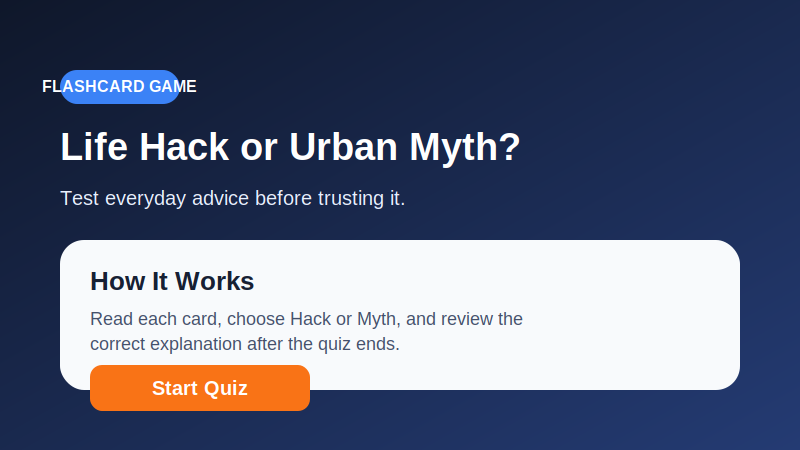
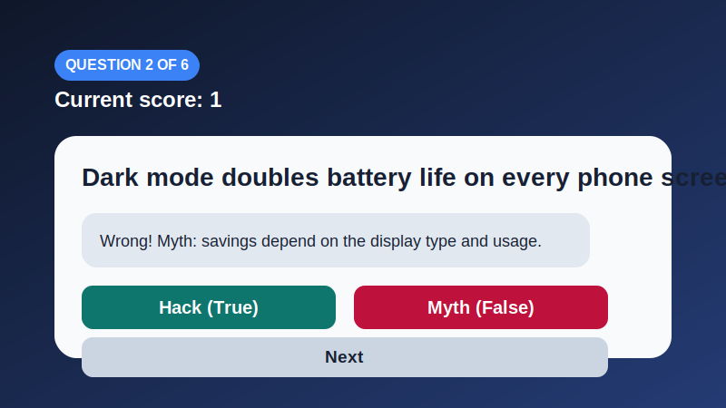

# Life Hack or Urban Myth?

An Android flashcard quiz built in Kotlin for **IMAD5112 Assignment 2 practice**. The app asks the user to decide whether each statement is a real productivity hack or just an internet myth, tracks the score, and provides a review screen with explanations for every answer.

## Project Snapshot





## Project Purpose

The purpose of this app is to help users:

- practise critical thinking around viral advice and online rumours
- learn the difference between safe, useful tips and misleading myths
- revise Android concepts such as multiple screens, loops, arrays/lists, score tracking, logging, and review screens

## Features

- **Welcome screen** with app description and a Start button
- **Quiz screen** that shows one statement at a time
- **Hack** and **Myth** buttons for true/false style answers
- **Next** button to move through the quiz
- **Running score** shown during the quiz
- **Personalised result screen** after the last question
- **Review screen** that lists every statement and its correct explanation
- **Logging** in each activity and during answer handling

## Technology Used

- **Language:** Kotlin
- **IDE:** Android Studio
- **UI approach:** XML layouts with `findViewById`
- **Architecture style:** Simple multi-activity app
- **Build tooling:** Gradle with Kotlin DSL
- **Testing:** JUnit and Android instrumentation test scaffold
- **Automation:** GitHub Actions workflow

## Screen Flow

1. `MainActivity` welcomes the user and starts the game.
2. `QuizActivity` presents each flashcard question, checks the answer, updates the score, and moves through the question list.
3. `ScoreActivity` shows the final score and custom feedback.
4. `ReviewActivity` displays all statements with the correct answers and explanations.

## Design Considerations

- The project uses **classic Android Views with XML layouts** to stay aligned with foundational coursework.
- Bright contrast colours and rounded cards make the interface easy to read and more engaging.
- The quiz logic is kept in small helper classes so that the Activities remain readable.
- The review screen uses a loop to assemble the full list of questions and answers.
- The wording of the statements was chosen to mix obviously useful tips with common internet misconceptions.

## Question Logic

The app stores a list of `HackQuestion` items. Each item contains:

- the statement shown to the user
- whether it is a real hack or a myth
- the explanation displayed after the answer

The quiz moves through the list by using the current question index. The score increases only when the chosen answer matches the correct question type.

## Code Structure

- `MainActivity` welcomes the user and starts the quiz.
- `QuizActivity` controls question display, answer checking, score tracking, and movement through the flashcards.
- `ScoreActivity` displays the total result and personalised feedback.
- `ReviewActivity` shows every statement with its correct answer and explanation.
- `HackQuestionRepository` stores the question data.
- `QuizJudge` keeps reusable logic for answer checking, score feedback, and review text generation.

## Manual Testing

The app should be tested manually for:

- app launch and welcome screen display
- navigation from the welcome screen to the quiz screen
- answer selection and feedback display
- score updates after correct answers
- movement through every question
- transition to the score screen after the last question
- opening the review screen
- returning to the home screen from review or restart

## Automated Testing

The project includes:

- unit tests for answer checking, score feedback, and review text generation
- a GitHub Actions workflow in `.github/workflows/build.yml`

The workflow runs:

```bash
./gradlew testDebugUnitTest lintDebug assembleDebug
```

## GitHub and Version Control

For a full coursework submission, the project can be pushed to a GitHub repository and committed regularly to show development progress. The workflow file supports automated validation after each push.

Suggested commit sequence:

1. `Initial Android project setup`
2. `Add welcome and quiz screens`
3. `Implement score tracking and review logic`
4. `Add tests and GitHub Actions workflow`
5. `Improve README and app polish`

## References

- GitHub. n.d. *Automated build Android app with GitHub Action*. Available at: https://github.com/marketplace/actions/automated-build-android-app-with-github-action [Accessed 26 April 2026].
- IMAD5112. n.d. *Github Actions build workflow*. Available at: https://github.com/IMAD5112/Github-actions/blob/main/.github/workflows/build.yml [Accessed 26 April 2026].

## Logging

`Log.d(...)` is used to show key program events, including:

- screen openings
- start button press
- user answer selection
- blocked next-click events
- quiz completion
- score screen and review navigation

## Video Demonstration

If this project is adapted for a real submission, add your unlisted YouTube video link here:

`PASTE_VIDEO_LINK_HERE`

## How to Run

1. Open the project in Android Studio.
2. Let Gradle sync complete.
3. Run the app on an emulator or Android device.
4. Play through the flashcards and review the explanations at the end.

## Study Note

This project is best used as a **practice solution** for learning Android structure, not as something to submit blindly. The safest use is to study the code, understand each screen, and rebuild or adapt it yourself.
